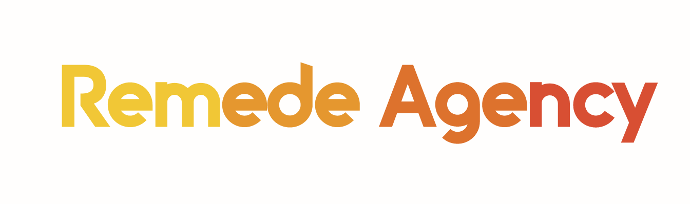

100 heures

Mis à jour le vendredi 18 mars 2022

Le nommage des livrables à déposer sur la plateforme a été changé et des indications sur les temps de soutenance ont été ajoutées le 16/03/2022.

Vous venez de commencer à travailler chez Remede Agency, une agence spécialisée dans le développement d'applications web. L'équipe est principalement composée de développeurs back-end et vient de commencer à recruter d'autres spécialistes front-end.

Logo de Remede Agency

Après quelques jours dans l’entreprise, vous recevez le courriel suivant :

> **Objet**: Bienvenue !  
> **De**: Mila  
> **À**: Moi
>
> Bienvenue dans l'équipe !
>
> Je m'appelle Mila Lavigne et je suis ta nouvelle cheffe de projet. Nous sommes très heureux que tu rejoignes l'équipe ! J’ai une excellente nouvelle : le contrat dont nous t’avons parlé lors de l'entretien a été accepté et le client est prêt pour qu’on démarre.
>
> Le projet concerne une nouvelle banque qui démarre, Argent Bank, qui essaie de percer dans le secteur et qui a besoin d'aide pour mettre en place son application. Nous avons obtenu un contrat en deux parties qui se décompose en plusieurs phases :
>
> - **Phase 1 : Authentification des utilisateurs** - Création d'une application web permettant aux clients de se connecter et de gérer leurs comptes et leur profil.
> - **Phase 2 : Transactions** - Il s’agirait de spécifier les endpoints d’API nécessaires pour une éventuelle deuxième mission une fois que nous aurons terminé la première.
>
> À la fin du projet, tu présenteras les deux livrables à Avery Moreau, qui gère l’équipe technique d’Argent Bank.
>
> Nous attendons encore des informations, mais je veillerai à ce que tu sois inclus dans toutes les communications pour que tu sois à jour sur le projet.
>
> Au plaisir de travailler avec toi !
>
> **Mila**  
> **_Cheffe de projet_**

_Quelques heures plus tard, vous recevez l’e-mail suivant :_

Logo de Argent Bank

> **Objet**: Brief mission profil Argent Bank  
> **De**: Avery  
> **À**: Moi, Mila
>
> Bonjour Mila et l’équipe,
>
> Je suis Avery Moreau VP Engineering chez Argent Bank. Nous sommes ravis de vous avoir avec nous pour créer notre application web React pour le nouveau système d'authentification des utilisateurs. Nous avons des délais très serrés et nous aurons besoin d’aide !
>
> Voici un aperçu de ce dont nous avons besoin pour la **phase 1 :** **Authentification des utilisateurs**.
>
> - Créer l’application web complète et responsive avec React. Comme point de départ, nous vous avons fourni le [HTML statique et le CSS](../../../designs) pour la page d'accueil, la page de connexion et la page de profil.
> - Utiliser Redux pour gérer le state de l'ensemble de l'application.
> - Ce que doit faire l’application (voir les détails pour chacune sur [nos modèles de GitHub Issues](../../../.github/ISSUE_TEMPLATE)) :
>
> - L'utilisateur peut visiter la page d'accueil
> - L'utilisateur peut se connecter au système
> - L'utilisateur peut se déconnecter du système
> - L'utilisateur ne peut voir les informations relatives à son propre profil qu'après s'être connecté avec succès
> - L'utilisateur peut modifier le profil et conserver les données dans la base de données.
>
> Vous pouvez commencer par forker [notre repo existant](https://github.com/OpenClassrooms-Student-Center/Project-10-Bank-API) et suivre l’avancement du travail grâce aux modèles d’Issues GitHub que nous y avons incluses.
>
> Nos ingénieurs back-end ont déjà créé toutes les API dont vous avez besoin. Vous trouverez toute la documentation Swagger à l'intérieur du repo.
>
> Pour la **phase 2 : Transactions**, nous sommes encore en phase de conception. De notre côté, nous mettons au point une fonctionnalité pour les transactions qui doit pouvoir permettre aux utilisateurs :
>
> - de visualiser toutes leurs transactions pour le mois en cours ;
> - de visualiser les détails d'une transaction dans une autre vue ;
> - d'ajouter, de modifier ou de supprimer des informations sur une transaction.
>
> Puisque vous gérez déjà l'application web pour la phase 1, nous voulons connaître votre avis sur la façon dont vous pensez que les API devraient être modélisées du côté back end. Nous avons besoin que vous nous fournissiez un document décrivant les API proposées pour les transactions, en suivant les directives de Swagger.
>
> Parmi les éléments clés à spécifier pour chaque endpoint de l’API il faudra :
>
> - La méthode HTTP (ex. : GET, POST, etc.)
> - La route (ex. : /store/inventory)
> - La description de ce à quoi correspond l’endpoint (ex. : Retour de l'inventaire des animaux de compagnie)
> - Les paramètres possibles pour tenir compte des différents scénarios (ex. : itemId (facultatif) = ID de l'article spécifique à demander à la base de données d'inventaire).
> - Les différentes réponses avec les codes de réponse correspondants qui ont un sens pour cet endpoint (ex. : 404 : réponse d'erreur d'article inconnu).
>
> Vous pouvez utiliser la page des transactions présentée dans les maquettes pour guider vos choix (mais vous n'avez pas besoin d'implémenter cette page). Assurez-vous simplement que le document est exporté vers un fichier YAML (c'est-à-dire Fichier > Enregistrer sous YAML) en utilisant la syntaxe Swagger, qui peut être exportée dans [l'outil d'édition de Swagger](https://editor.swagger.io/).
>
> Nous ferons une revue de code et discuterons ensemble de la proposition d'API une fois que tout sera terminé.
>
> Au plaisir de travailler avec vous !
>
> **Avery Moreau**

Vous remarquez que l'interface est en anglais. Même si vous n'êtes pas très à l'aise dans cette langue, vous vous dites que c'est l'occasion de pratiquer un peu ! C'est toujours bien pour un développeur de lire l'anglais, car la documentation professionnelle se fait souvent dans cette langue. Et Google Traduction est votre ami 😉

Toutes ces informations en main, vous vous mettez au travail dès que possible !

### Livrables

Pour ce projet, vous devrez créer les éléments suivants :

1.  Un fichier au format TXT contenant le lien vers votre **code** sur GitHub remplissant toutes les exigences de la **phase 1** : Authentification de l'utilisateur.
2.  Un fichier **swagger** au format YML des modèles d'API proposés avec les endpoints requis pour la **phase 2** : Transactions.

Pour faciliter votre passage devant le jury, déposez sur la plateforme, dans un dossier zip nommé “**_Titre_du_projet_nom_prénom_**”, avec tous les livrables du projet comme suit : **Nom**\_**Prénom**\_**n° du livrable**\_**nom du livrable**\_\_**date de démarrage du projet**. Cela donnera :

- _Nom_Prénom_1_code_phase_1_\__mmaaaa ;_
- _Nom_Prénom_1_swagger_phase_2_\__mmaaaa._

Par exemple, le premier livrable peut être nommé comme suit _: Dupont_Jean_1_code_phase_1_\__012022._

### Soutenance

La présentation sera structurée comme suit, l'évaluateur jouant le rôle d'Avery Moreau :

- **Présentation des livrables (15 minutes)**
- **Discussion (10 minutes)**

- L'évaluateur vous posera des questions sur votre méthodologie et vos résultats.
- Soyez prêt à défendre votre travail, car l'évaluateur contestera vos décisions.

- **Debrief (5 minutes)**
  - L'évaluateur cessera de jouer le rôle d'Avery Moreau afin que vous puissiez debriefer ensemble.

Votre présentation devrait durer 15 minutes (+/- 5 minutes). Puisque le respect de la durée des présentations est important en milieu professionnel, les présentations en dessous de 10 minutes ou au-dessus de 20 minutes peuvent être refusées.

### Compétences évaluées

- Implémenter un gestionnaire d'état dans une application React
- Intéragir avec une API
- Modéliser une API
- S'authentifier à une API
